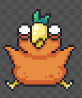
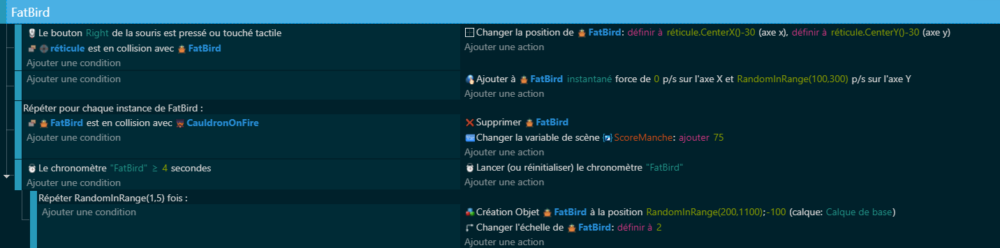

# Chapitre 3 : Deuxième Ennemi - Le FatBird 🦜
## Introduction
Félicitations pour ton progrès jusqu'à présent ! Dans ce chapitre, nous allons introduire un nouvel obstacle amusant : le FatBird. Ce défi ajoutera une touche supplémentaire d'amusement à ton jeu. Prépare-toi à le faire tomber de haut en bas de l'écran et à le capturer dans un chaudron pour marquer des points. C'est parti ! 🤩

## Mise en Place du FatBird sur la Scène

Création du FatBird 🐦 - Introduis le FatBird comme nouvel élément de jeu. Place-le judicieusement pour commencer sa chute.
le Chaudron 🪄 - Le but ultime est de guider le FatBird vers un chaudron magique, transformant sa capture en points.

## Variables et Comportements

Comportement destruction hors de l'écran : Grace a celui-ci, on pourra optimiser le jeu sans bug, car sans celui, si chaque FatBird tomberait à l'infini jusqu'à l'oublie.

## Code

## Conclusion et Prochain Chapitre

Excellent travail d'ajout du FatBird à ton jeu, rendant l'expérience encore plus dynamique ! Expérimente avec différents placements et timings pour rendre le jeu unique.

[Lien vers le Chapitre 4 : Le Système de Vague avec le Score](https://github.com/g404-code-gaming/BirdHunt/blob/main/Création-Du-Jeu/4.Système%20De%20Vague.md) 🌪️

Maintenant que tu as ajouté de la variété à ton jeu, voyons comment intégrer un système de vagues pour rendre le challenge encore plus intéressant. Prêt à plonger dans la suite ? 🌊
