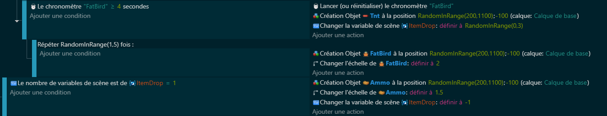
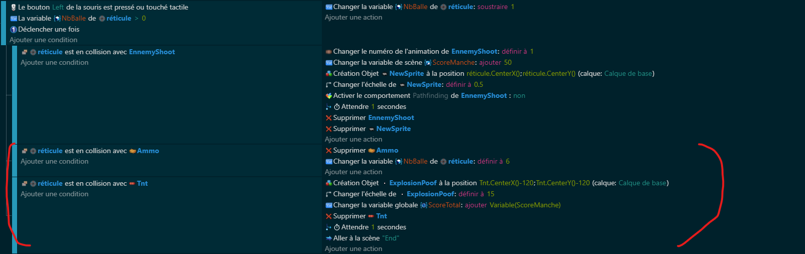
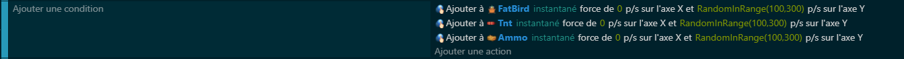

# Chapitre 5 : Boîte de Munition et TNT 💣
## Introduction
Bravo pour avoir maîtrisé les vagues ! Maintenant, ajoutons un twist avec deux nouveaux éléments : les boîtes de munition pour recharger ton arme, et le TNT, un malus à éviter à tout prix. Ces ajouts vont diversifier le gameplay et te forcer à réfléchir deux fois avant de tirer. Prépare-toi, ça devient sérieux ! 🎯

## Bon Usage des Boîtes de Munition

Rôle vital des Boîtes de Munitions 📦 - Elles sont là pour que tu ne te retrouves jamais à court de balles. Un atout précieux dans la durée du jeu.

Placement et Stratégie 🗺️ - Réfléchis bien où les placer pour aider au mieux le joueur sans pour autant rendre le jeu trop facile.

## La Malédiction du TNT

Danger du TNT 💥 - Contrairement aux idées reçues, le TNT n'est pas ici pour t'aider. Si tu tires dessus, c'est game over ! Une bonne raison de viser avec soin.

Quand Risque Rime avec Stratégie 🧠 - Le TNT t'oblige à mieux contrôler ta frénésie de tirs et ajoute un élément de tension au jeu. Sois prudent !

## Code

1. Code Génération items

   
2. Code interaction avec le tir

3. Code déplacement des items

## Conclusion et Prochain Chapitre

Avec l'introduction des boîtes de munition et du piège que représente le TNT, ton jeu Duck Hunt gagne en complexité et en stratégie. Chaque tir doit être pesé, renforçant ainsi l'immersion et le challenge du jeu.

[Lien vers le Chapitre 6 : Les Menus](https://github.com/g404-code-gaming/BirdHunt/blob/main/Création-Du-Jeu/6.Menu.md) 📝

Il est temps de conclure notre aventure avec un dernier élément crucial : les menus. Un bon menu peut transformer l'expérience joueur de bonne à exceptionnelle. Prêt à peaufiner ton jeu ? À toi de jouer ! 🌟
