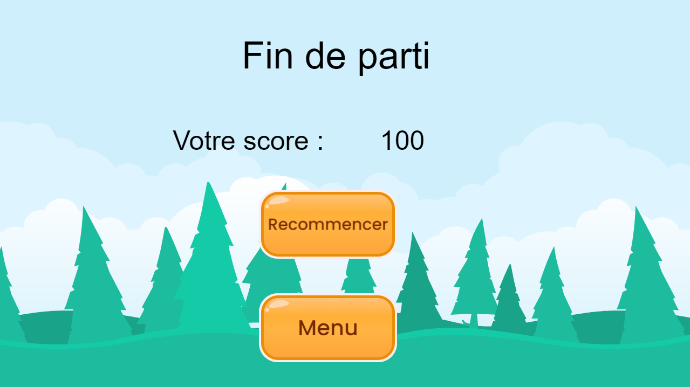
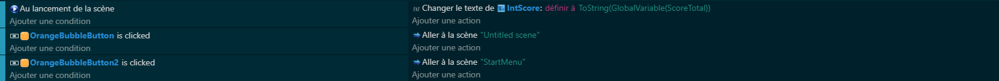

# Chapitre 6 : Les Menus 📝
## Introduction
Après avoir traversé les défis des vagues, des boîtes de munitions et du TNT, il est temps de s'intéresser à un aspect tout aussi crucial : les menus. Un bon menu rassemble et donne accès à toutes les fonctionnalités du jeu de manière intuitive. Nous allons créer un menu principal pour lancer le jeu et un menu de fin pour afficher les scores. C'est parti pour rendre ton jeu encore plus complet (Chaque menu dans une nouvelle scène)! 🚀

## Partie 1 : Le Menu de Fin

Affichage du Score 🎯 - À la fin de la partie, un écran s'affiche pour montrer le score final du joueur. C'est le moment de comparer ses résultats et de ressentir la satisfaction du travail accompli.

Retour au Menu Principal ou Quitter 🔙 - Offre au joueur la possibilité de recommencer une partie ou de quitter le jeu. Un choix simple qui invite à la rejouabilité.

## Code 

## Partie 2 : Le Menu Principal

Lancer une Nouvelle Partie ▶️ - Le coeur du menu principal. Un bouton pour démarrer l'aventure, clair et accessible.

Options et Personnalisations ⚙️ - Un espace dédié aux réglages du jeu pour que chaque joueur puisse ajuster son expérience comme il le souhaite.

## Code 

## Conclusion

Et voilà, tu as maintenant un jeu Duck Hunt complet avec des menus bien pensés pour une expérience utilisateur optimisée. Ces menus ne sont pas seulement fonctionnels, ils ajoutent également une touche professionnelle à ton jeu, invitant les joueurs à explorer et à revenir jouer encore et encore.
