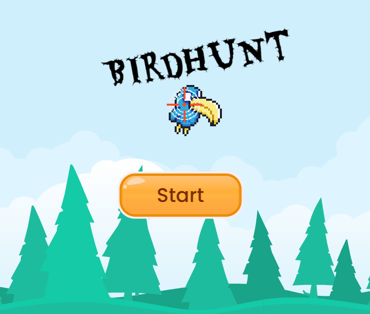

# 🌟 Introduction au Jeu 🌟
Bienvenue jeunes développeurs! Aujourd'hui, on va plonger dans un classique revisité, notre version personnalisée de Duck Hunt 🦆. Préparez-vous à entrer dans un monde où votre adresse et votre rapidité seront mises à l'épreuve. Dans ce jeu, vous allez chasser des oiseaux 🐦 et explorer un univers plein de surprises avec des animations explosives 💥! 

# 🛠️ Liste des Assets Nécessaires 🛠️
Voici tout ce dont vous aurez besoin pour créer notre version de Duck Hunt:

>Un Réticule 🎯 - Pour viser les oiseaux avec précision.
>
>Un Fond 🌌 - Où se déroulera l'action épique.
>
>Un Compteur de Balles 🔢 - Pour garder une trace de vos munitions.
>
>Un Chaudron 🍲 - Pour y mettre les oiseaux après les avoir attrapés.
>
>Un Type de Personnage à Tirer Dessus 🎭 - Les cibles volantes.
>
>Un Type de Personnage à Mettre dans le Chaudron en Feu 🔥 - Attrapez-les si vous pouvez!
>
>Un "Bang" pour Indiquer que le Personnage a Tiré 💥 - Pour l'impact visuel et sonore.
>
>Une Caisse de Munition 📦 - Pour recharger!
>
>Une TNT 💣 - Pour un effet explosif.
>
>Une Animation d'Explosion 🌋 - Pour une satisfaction garantie lors d'une réussite explosive.

# 🎮 Tester le Jeu 🎮
Après avoir progressé dans la création de notre Duck Hunt moderne, il est crucial de tester 🕹️ votre chef-d'œuvre. Tester le jeu vous permet de repérer les bugs 🐛, améliorer les mécaniques de jeu et s'assurer que l'expérience est aussi amusante que prévue!

Pour tester le jeu, voici un lien spécialement préparé pour vous : [Jouez à notre Duck Hunt!](https://gd.games/instant-builds/0458f593-b809-4ea5-8fd6-f64e82596739) 

N'oubliez pas : tester est une étape essentielle du développement de jeux. Cela vous aide à comprendre ce qui fonctionne, ce qui peut être amélioré, et surtout, à voir votre jeu à travers les yeux des joueurs 🕵️‍♂️.

Voilà ton arsenal! Prêt à commencer cette aventure? Dans les prochaines étapes, nous allons apprendre à assembler ces éléments pour donner vie à notre jeu.
